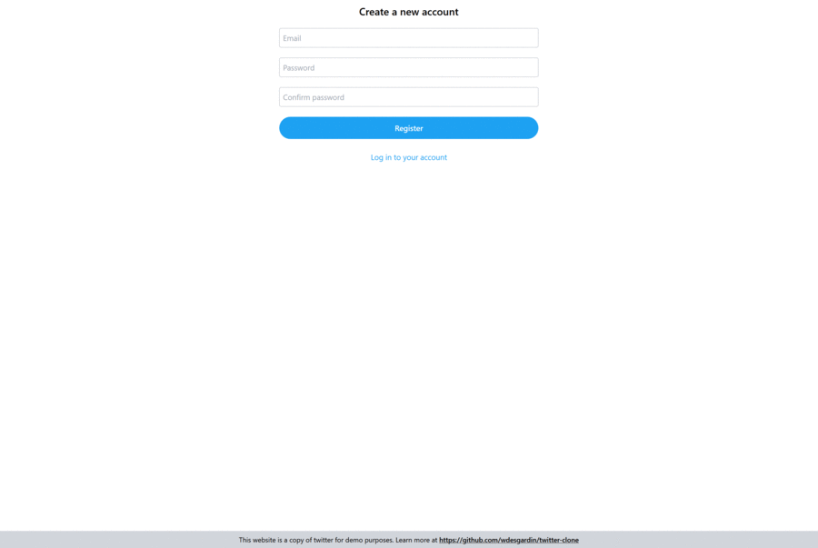

# 🚀 Ping — Social Microblogging Platform

Ping is a modern microblogging platform inspired by Twitter (X), built with ASP.NET Core and React, following Clean Architecture principles.

This project demonstrates scalable backend design, real-time communication, and modern frontend development practices.

---

## 👨‍💻 Author

Mohammadreza Javaheri  
Email: mohammad.r.javaheri@gmail.com  

---

## ✨ Features

- User authentication & profile management
- Create and publish posts (Pings)
- Real-time updates using SignalR
- Responsive UI with TailwindCSS
- Clean Architecture implementation
- CQRS pattern with MediatR
- Unit & Integration testing
- Docker support

---

## 🛠 Tech Stack

Backend:
- ASP.NET Core 5
- Entity Framework Core 5
- MediatR (CQRS)
- AutoMapper
- FluentValidation
- SignalR

Frontend:
- React
- TailwindCSS

Testing:
- NUnit
- FluentAssertions
- Moq
- Respawn

DevOps:
- Docker
- GitHub Actions CI

---

## 🏗 Architecture

The project follows Clean Architecture structure:

src
 ├── Domain
 ├── Application
 ├── Infrastructure
 └── WebUI

Domain:
Contains business entities, enums, exceptions, interfaces, and core rules.

Application:
Contains use cases and application logic. Depends only on the Domain layer.

Infrastructure:
Implements external services such as database, file storage, email services, and third-party integrations.

WebUI:
Presentation layer built with ASP.NET Core Web API and React SPA.
Only Startup.cs references Infrastructure for dependency injection.

---

## 🚀 Getting Started

Prerequisites:
- .NET 5 SDK
- Node.js LTS

Run the Application:

Navigate to:
src/WebUI

Run:
dotnet run

This starts:
- ASP.NET Core API
- React Frontend

---

## 🗄 Database Configuration

By default, Ping uses an In-Memory Database.

To use PostgreSQL:

Open:
WebUI/appsettings.json

Update:
"UseInMemoryDatabase": false

Configure:
"DefaultConnection": "Host=localhost;Database=pingdb;Username=postgres;Password=yourpassword"

The database and migrations will be applied automatically on startup.

---

## 🧩 Database Migrations

From repository root:

dotnet ef migrations add MigrationName --project src/Infrastructure --startup-project src/WebUI --output-dir Persistence/Migrations

Example:

dotnet ef migrations add InitialCreate --project src/Infrastructure --startup-project src/WebUI --output-dir Persistence/Migrations

---

## 🐳 Running with Docker

docker-compose up --build

---

## 📜 License

Licensed under the MIT License.

